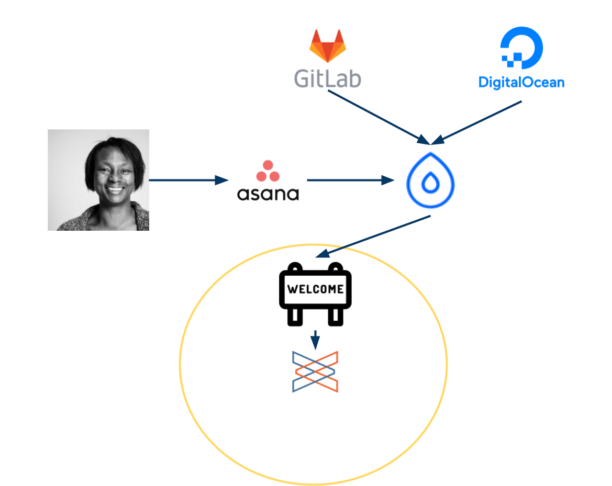
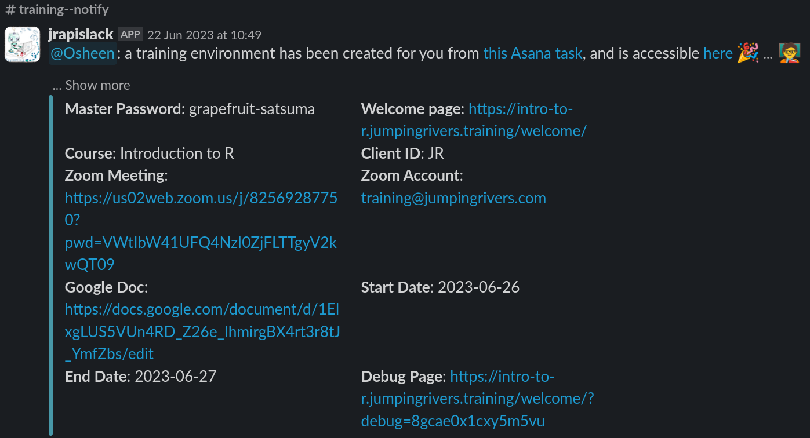
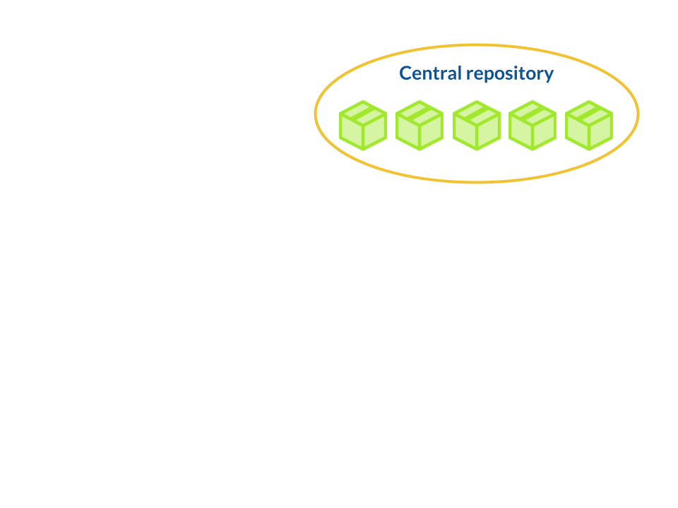
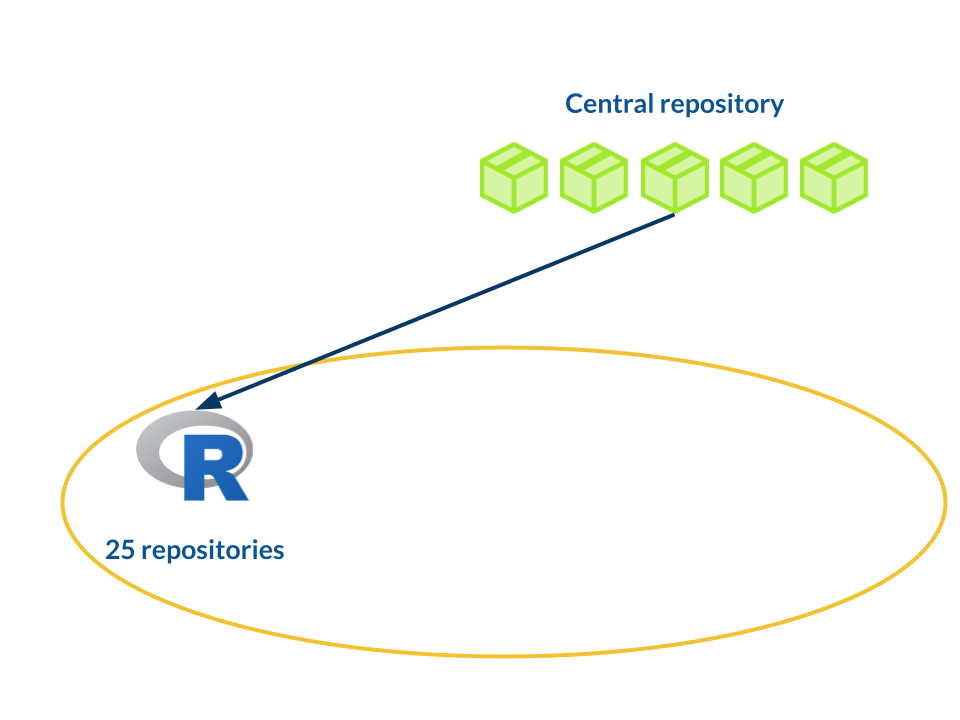
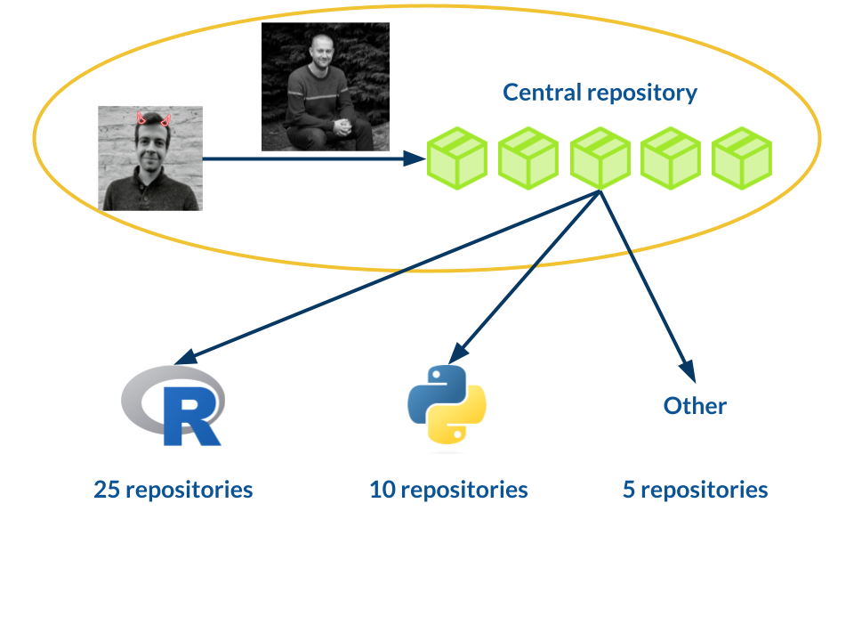

```{r setup, include = FALSE}
options(htmltools.dir.version = FALSE)
library(knitr)
library(fontawesome)
library(xaringanExtra)
# set default options
opts_chunk$set(echo = FALSE,
               collapse = TRUE,
               fig.width = 7.252,
               fig.height = 4,
               dpi = 300)
xaringanExtra::use_tile_view()
xaringanExtra::use_broadcast()
xaringanExtra::use_panelset()
xaringanExtra::use_share_again()
xaringanExtra::style_share_again(
  share_buttons = c("twitter")
)
```

class: right, top
background-image: url(https://images.unsplash.com/photo-1472289065668-ce650ac443d2?ixlib=rb-1.2.1&auto=format&fit=crop&w=1350&q=80)
background-position: 75% 75%
background-size: cover

.right-column[
# `r rmarkdown::metadata$title`

### `r rmarkdown::metadata$author`</br></br>

#### http://bit.ly/jr-teach-r
]

.left[.footnote[<span>Photo by <a href="https://unsplash.com/@joannakosinska?utm_source=unsplash&amp;utm_medium=referral&amp;utm_content=creditCopyText">Joanna Kosinska</a> on <a href="https://unsplash.com/backgrounds/colors?utm_source=unsplash&amp;utm_medium=referral&amp;utm_content=creditCopyText">Unsplash</a></span>]]

---

name: jr
## Jumping Rivers

.pull-left[

]

.pull-right[
.right[
### Stats Consultancy
### R & Python training
### Infrastructure
]
]


---

name: many-training-courses

## Over a hundred courses a year

```{r}

```

???
* We deliver over 100 R, Python and Stan training courses each year
* Engaging with thousands of new learners.

---
class: top inverse

# Before 2020

--

### `r fa(name = "user-friends", fill = "white")` &nbsp; In person training

--

### `r fa(name = "house-chimney", fill = "white")` &nbsp; Ran RStudio locally

--

### `r fa(name = "file-lines", fill = "white")` &nbsp; Physical notes and exercises

--

### `r fa(name = "face-smile-beam", fill = "white")` &nbsp; Very interactive

--

### `r fa(name = "virus", fill = "white")` &nbsp; Then March 2020 happened...

---
class: top inverse

# Moving training online

--

### `r fa(name = "user-friends", fill = "white")` &nbsp; We tested online training internally

--

### `r fa(name = "tired", fill = "white")` &nbsp;  It was DULL


--

### `r fa(name = "code", fill = "white")` &nbsp; Made it more interactive

--

### `r fa(name = "layer-group", fill = "white")` &nbsp; Lots of work for trainers

--

### `r fa(name = "robot", fill = "white")` &nbsp; Automated as much as possible

???

The necessity to move to fully online training in March last year meant we quickly had to completely rethink how to deliver R training interactively online. We internally trialled running our usual in-person training just on Zoom - and it really doesn’t work trust us!

---
class: middle inverse

# Our training stack

---
class: middle
```{r fig.align='center', out.width="80%"}

```

---
class: middle
```{r fig.align='center', out.width="80%"}

```

---
class: middle
```{r fig.align='center', out.width="100%"}

```

---
class: middle
```{r fig.align='center', out.width="80%"}

```

---

class: middle
```{r fig.align='center', out.width="100%"}

```

---
class: middle
```{r, eval = FALSE, echo = TRUE}
jrDroplet::create_droplet_from_asana("https://app.asana.com/...")
ℹ Creating a Droplet from Asana task
...
✓ Droplet configuration finished
```

---

class: middle
```{r fig.align='center', out.width="100%"}

```

---

class: middle
```{r fig.align='center', out.width="100%"}

```

---

class: middle
```{r fig.align='center', out.width="100%"}

```

---

class: middle 
```{r fig.align='center', out.width="100%"}

```

---

class: middle
```{r fig.align='center', out.width="100%"}

```

---

class: middle
```{r fig.align='center', out.width="80%"}

```

---
class: middle
```{r fig.align='center', out.width="100%"}

```


---
class: middle

```{r fig.align='center', out.width="80%"}

```

---
class: middle
```{r fig.align='center', out.width="100%"}

```

---
class: middle

```{r fig.align='center', out.width="100%"}

```

---
class: middle
```{r fig.align='center', out.width="100%"}

```

---
class: middle

```{r fig.align='center', out.width="80%"}

```

---
class: middle
```{r fig.align='center', out.width="100%"}
include_graphics("img/flow-9.png")
```

---
class: middle
```{r fig.align='center', out.width="100%"}

```

---
class: middle inverse

# Our standardised approach

---
class: middle
```{r fig.align='center', out.width="100%"}

```

---
class: top inverse

# Central repository

--

### `r fa(name = "box", fill = "white")` &nbsp; Internal R packages for building courses

--

### `r fa(name = "list-ol", fill = "white")` &nbsp; Makefiles

--

### `r fa(name = "code", fill = "white")` &nbsp; GitLab CI/CD rules

--

### `r fa(name = "layer-group", fill = "white")` &nbsp; Other template files (.gitignore, README, etc)

--

### `r fa(name = "sitemap", fill = "white")` &nbsp; Standardised course structure

---
class: middle
```{r fig.align='center', out.width="100%"}

```

---
class: top inverse

# R courses

--

### `r fa(name = "octopus-deploy", fill = "white")` &nbsp; ~25 downstream repositories

--

### `r fa(name = "markdown", fill = "white")` &nbsp; Materials written in R Markdown

--

### `r fa(name = "file-pdf", fill = "white")` &nbsp; Notes compiled to PDF

--

### `r fa(name = "html5", fill = "white")` &nbsp; Slides compiled to HTML

--

### `r fa(name = "r-project", fill = "white")` &nbsp; Scripts / exercises converted to .R

---
class: middle
```{r fig.align='center', out.width="100%"}

```

---

class: top inverse

# Non-R courses

--

### `r fa(name = "code", fill = "white")` &nbsp; Code chunks in Python, SQL, etc

--

### `r fa(name = "face-smile-beam", fill = "white")` &nbsp; ... that's all!

---
class: middle
```{r fig.align='center', out.width="100%"}

```

---
class: middle
```{r fig.align='center', out.width="100%"}

```

---
class: middle
```{r fig.align='center', out.width="100%"}

```

---

class: top inverse

# Alert system

--

### `r fa(name = "code", fill = "white")` &nbsp; Changing central repo triggers CI

--

### `r fa(name = "sitemap", fill = "white")` &nbsp; Downstream repos also triggered

--

### `r fa(name = "bullhorn", fill = "white")` &nbsp; Fails are flagged on Slack

--

### `r fa(name = "calendar-check", fill = "white")` &nbsp; All courses tested monthly

---
class: middle
```{r fig.align='center', out.width="100%"}

```

---
class: middle
```{r fig.align='center', out.width="100%"}

```

---
class: middle inverse

# R for admin!

---
class: top inverse

# R for admin!

--

### `r fa(name = "dollar-sign", fill = "white")` &nbsp; Pricing app generates quotes

--

### `r fa(name = "trophy", fill = "white")` &nbsp; Post-training certification

--

### `r fa(name = "user-friends", fill = "white")` &nbsp; Attendee feedback summaries

---
class: middle inverse

# Is it worth it?

---
name: worth-it
# Worth the effort?

```{r, out.width = "70%", fig.cap="https://xkcd.com/1205/", fig.align='center'}
include_graphics("img/xkcd-1205.png")
```

---
class: top inverse

# Benefits

--

### `r fa(name = "layer-group", fill = "white")` &nbsp; Less duplication

--

### `r fa(name = "pencil", fill = "white")` &nbsp; Easy(ish) to write new courses

--

### `r fa(name = "bullhorn", fill = "white")` &nbsp; Issues are flagged immediately

--

### `r fa(name = "chalkboard-teacher", fill = "white")` &nbsp; Trainer can focus on ... training!

--

### `r fa(name = "globe", fill = "white")` &nbsp; >100 courses taught per year

--

### `r fa(name = "sitemap", fill = "white")` &nbsp; Asana is an accessible interface

---
class: middle
```{r fig.align='center', out.width="100%"}

```

---
class: top inverse

# Drawbacks

--

### `r fa(name = "r-project", fill = "white")` &nbsp; R-centric setup

--

### `r fa(name = "face-grimace", fill = "white")` &nbsp; Course structure can be restrictive...

--

### `r fa(name = "hammer", fill = "white")` &nbsp; One change can break 40 repositories!

---
class: middle
```{r fig.align='center', out.width="100%"}

```

---
class: top inverse

# Take-home lessons

--

### `r fa(name = "ring", fill = "white")` &nbsp;  One central location

--

### `r fa(name = "box", fill = "white")` &nbsp;  Packaging source code

--

### `r fa(name = "code", fill = "white")` &nbsp;  Utilise CI/CD and Git workflow

--

### `r fa(name = "chalkboard-teacher", fill = "white")` &nbsp; Focus on what matters

--

### `r fa(name = "user-friends", fill = "white")` &nbsp; Think about your colleagues

---

class: right, middle, inverse


## Learn more...

#### [`r fa(name = "twitter")` @jumping_uk](https://twitter.com/jumping_uk)  
#### [`r fa(name = "link")` jumpingrivers.com](https://www.jumpingrivers.com/)  
#### [`r fa(name = "slideshare")` http://bit.ly/jr-teach-r](http://bit.ly/jr-teach-r)  

