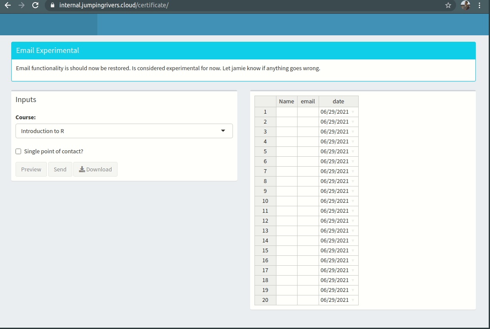

---
name: jrCertificate

# jrCertificate

.panelset[
.panel[.panel-name[What]

```{r fig.align='center', out.width="80%"}

```

]

.panel[.panel-name[Why]

- Easy for non-tech
- Direct emails

```{r, out.width = "60%"}
magick::image_read_pdf("demos/Rhian_Davies_Getting_to_Grips_with_the_Tidyverse_certificate.pdf",
                       pages = 1)
```

]

.panel[.panel-name[How]

- {emayili} for sending emails
- {RHandsontable} for copy-paste table
- {magick} for `image_annotate()`

]
]
